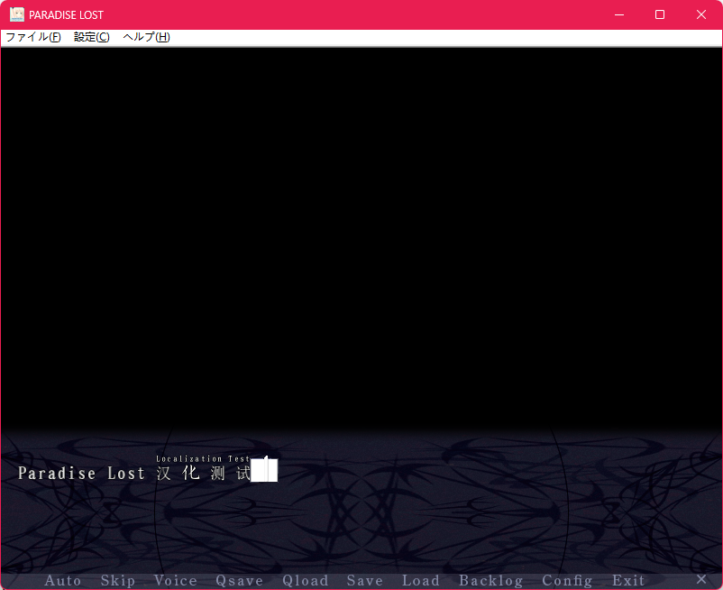

# 神座补完计划-Paradise Lost 开源汉化

神座系列第二天的故事——失乐园，首发于2004年，14岁神的处女作。

## 开源汉化

开坑已汉化本文继承于文佬，大部分可见其b站视频

因为文本量较大，加之没有多余精力兼顾。所以采用开源汉化的方式，号召有志的神座粉丝参与补完

每完成到一个进度都会发布一次补丁，汉化工程完全结束后会公开完整补丁。

## 使用方法

补丁只适用于2017年发布的[Masada Premium版](https://vndb.org/r52327)

将补丁文件data9.dat放入游戏根目录即可

## To Do List

文本：60w/100w

未汉化部分，诺武线的大部分，所有hs

修图：screen/config/ *.png

`config_tex1.png, game_tex1.png, shortcut_tex1.png, sound_tex1.png`

与英语本地化同步进行，2/4

视频字幕：picture/event/*.webm

`pl_inter.webm, pl_lie_final.webm, pl_no_final.webm, pl_second.webm, pl_third.webm`

0/5

## 如何参与汉化

汉化文件：cn_pl_msg.txt

术语参考表：glossary_table.md

对cn_pl_msg.txt进行翻译后提交pull request即可

## 工具合集

- [Crsky](https://github.com/crskycode/Malie_Script_Tool) （Malie ScriptTool）

- [satan53x](https://github.com/satan53x/SExtractor) （Malie's packer）

## 特别感谢
- deca
- akari